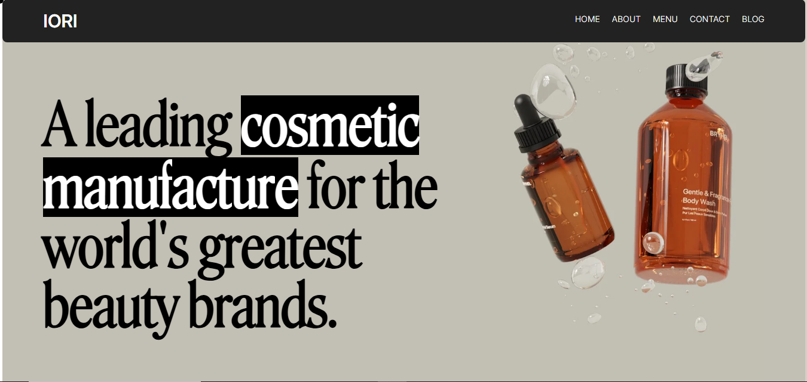

# Iori 💄

**Iori** is a beautifully crafted, fully responsive cosmetics website built with **React**, **Tailwind CSS**, **GSAP**, **Framer Motion**, and subtle animations to bring the user experience to life. Each section draws visual inspiration from a variety of modern beauty and cosmetic brand websites — blending them into a clean, elegant design with smooth transitions and scroll effects.

🔗 **Live Preview:** [iori.vercel.app](https://iori.vercel.app/)



---

## 🧰 Tech Stack

- ⚛️ React (via Vite)
- 🎨 Tailwind CSS
- 🎞️ GSAP (GreenSock Animation Platform)
- 🌀 Framer Motion
- ⚡ Vite

---

## 🚀 Getting Started

To run this project locally:

```bash
git clone https://github.com/Sannan144/iori.git
cd iori
npm install
npm run dev
